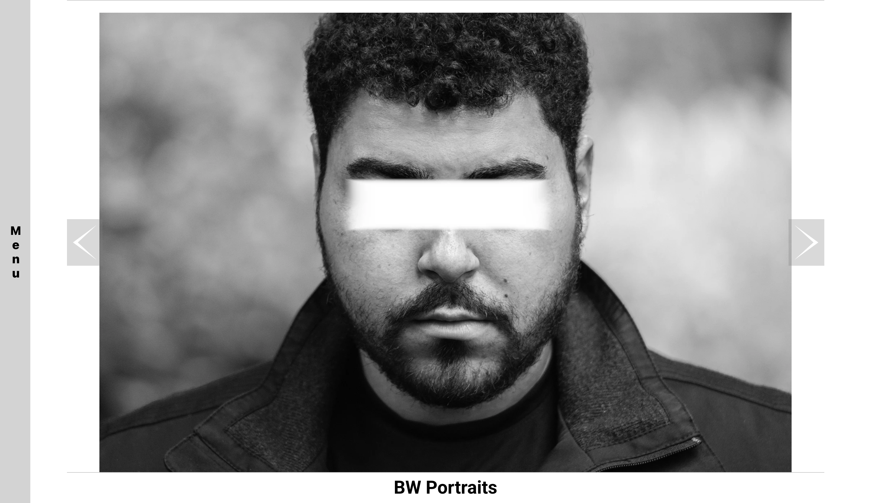

# Photography Portfolio (2024)

 

### About

- A project showcasing some of my photography and coding projects
- Made in the summer of 2024
- In mid-2025 I censored all of my subjects faces to protect them from AI image generation

 

### Launch the App

- Check out the web app [here!](https://krishhfi.github.io/Kristopher-Pepper-Portfolio-OLD/)

1) Install Node.js
2) Download the project and extract the folder.
3) Navigate to the project folder in Command Prompt.
4) Execute the command "npm install".
5) Execute the command "npm start".
6) Open [http://localhost:3000](http://localhost:3000) to view it in your browser.

